# Vehicle Detection and Tracking Writeup
## Goals & Steps

The goals and steps of this project are the following:

* Re-use the code and lane detection pipeline from project 4, term 1
* Perform feature extraction of following features and normalize them:		
  * Histogram of Oriented Gradients (HOG)
  * Binned color spatial features
  * color histogram features for all 3 color channels
* Randomize a selection for training and testing data
* Train a Linear SVM classifier with features, extracted from labeled training set of (vehicle and non-vehicle) images and test it with the testing set
* Implement a HOG Subsampling sliding-window technique
* Create a heat map of recurring detections frame by frame to reject outliers and follow detected vehicles
* Track vehicles frame by frame to sort out the outliers and false positives on the one hand and smooth bounding boxes on the other hand
* Test the vehicle detection pipeline (applying SVM to sliding windows) on single frames of the video from the vehicle drive
* Run the pipeline on a video stream (started with the test_video.mp4 and later implemented on full project_video.mp4) 
* Estimate a bounding box for vehicles detected.

## [Rubric](https://review.udacity.com/#!/rubrics/513/view) Points
Here I will consider the rubric points individually and describe how I addressed each point in my implementation.  

### Writeup
---
I provide a Writeup, which you're currently reading, that addresses all the rubric points.

### Histogram of Oriented Gradients (HOG)
---

#### 1. Extracting HOG features from the training images

In order to train classifier, I've extracted all 3 features at once. The starting point are lines #214 - 217 in file `vehicle_detector.py`. Implementation can be found in lines 102 - 153 in function `extract_features()` of the file `vehicle_detector.py` Each feature is extracted in corresponding functions in lines:

* Histogram of Oriented Gradients (HOG): lines 76 - 100, function `get_hog_features()` of the file `vehicle_detector.py`
* Binned color spatial features: lines 45 - 54, function `bin_spatial()` of the file `vehicle_detector.py`
* color histogram features for all 3 color channels: lines 56 - 74, function `color_hist()` of the file `vehicle_detector.py`

I started by reading in all the `vehicle` and `non-vehicle` images.  Here is an example of one of each of the `vehicle` and `non-vehicle` classes:

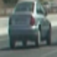 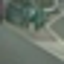

Then I've explored different color spaces and different `skimage.hog()` parameters (`orientations`, `pixels_per_cell`, and `cells_per_block`).  I grabbed random images from each of the two classes and displayed them to get a feel for what the `skimage.hog()`. Here is an example using the RGB2`YCrCb` color space and HOG parameters of `orientations=8`, `pixels_per_cell=(8, 8)` and `cells_per_block=(2, 2)`:

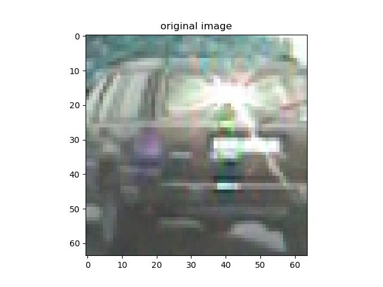 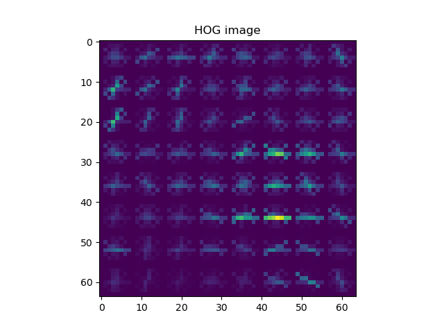

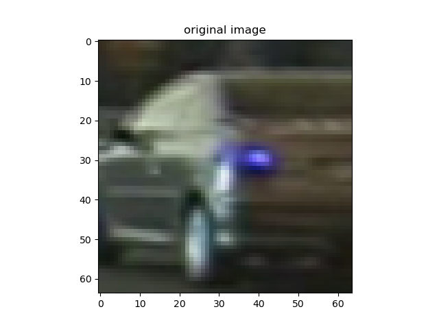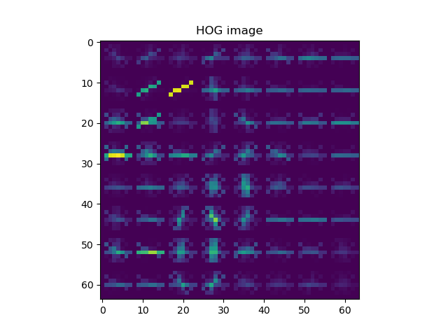 

More examples can be found in directory `../output_images/HOG_images/`

#### 2. Final choice of HOG parameters.
I tried various combinations of parameters and have found an optimal set of parameters by evaluating the performance of the Support Vector Machines Linear classifier.

#### 3. Train an SVM classifier using 3 types of features
The code for training SVM classifier can be found in lines 206 - 254, function `train_classifier()` of the file `vehicle_detector.py`. This function is invoked if no `svm_params.pkl` file is found in the root directory. For training I have also used the `StandardScaler()` for scaling the images while preprocessing. The test accuracy of my classifier resulted in 99.04%.

For training I have used all available GTI and KITTI images.

### Sliding Window Search
---

#### Implementation of a sliding window search.  
I decided to use Hog Sub-sampling Window Search, since this is a a more efficient method for doing the sliding window approach. It allows me to only have to extract the Hog features once. I have limited search to the lower part of the frame, by setting margins of the y axis to the range of [380 : 656] pixels.

The implementation of this approach can be found in lines 256-361, function `detect_vehicles()` of the file `vehicle_detector.py`. 

For each window, in case of successful vehicle detection, I've collected all bounding boxes, and applied a heatmap to get multiple detections overlap and this increase the detection probability of the vehicle. This functionality is invoked in lines 335 - 343, function `detect_vehicles()` of the file `vehicle_detector.py`.  The implementation of these functions can be found in lines 156 - 171, functions `add_heat()` and `apply_threshold()` of the file `vehicle_detector.py`. 

### Vehicle tracker
---
Since the whole pipeline still generated some false positives and the bounding boxes of the detections weren't smooth, I have implemented 2 additional classes: `VehiclesTracker`, file `vehicles_tracker.py` and `VehicleBBox`, file `vehicle_bbox.py`. The idea behind it is to track the bounding boxes of each detection over multiple frames, smooth out detections as well as bounding boxes all over the video stream processing.

### Examples of test images to demonstrate how your pipeline is working
---
#### Sliding window

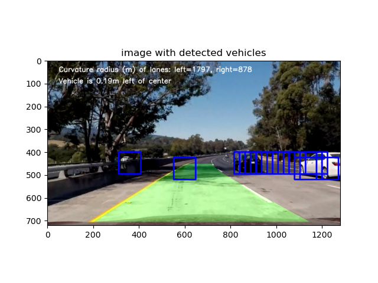

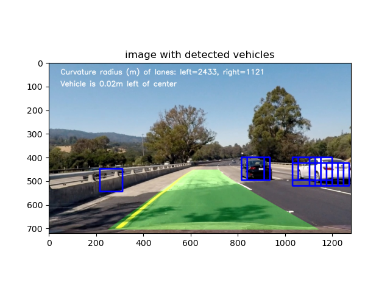

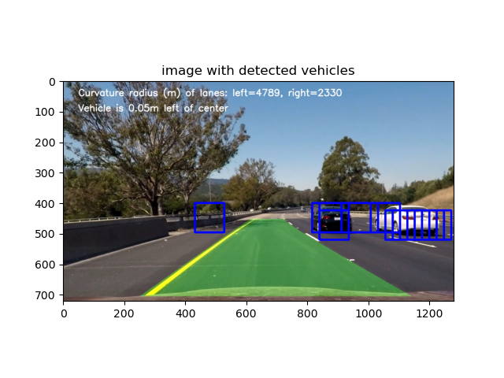

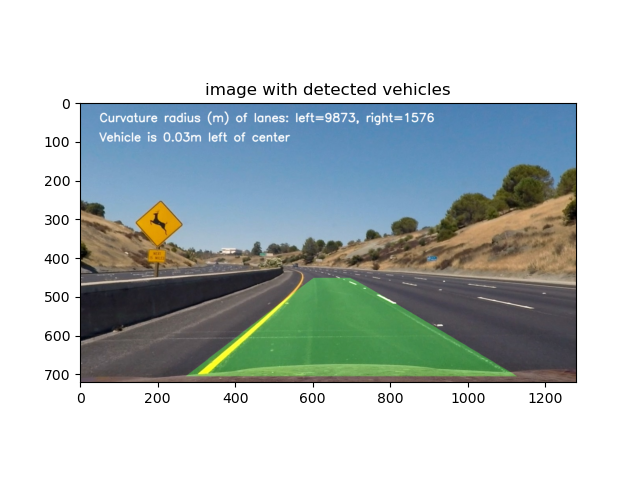

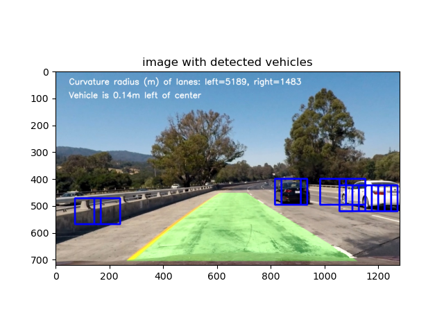

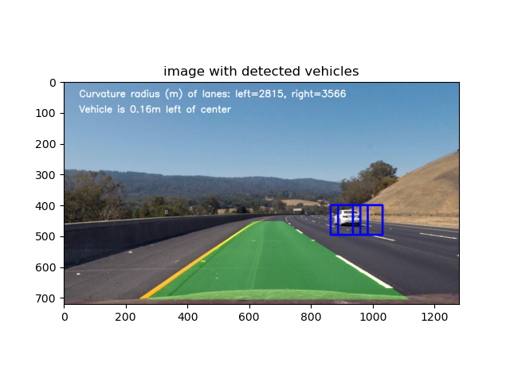

#### Heat map

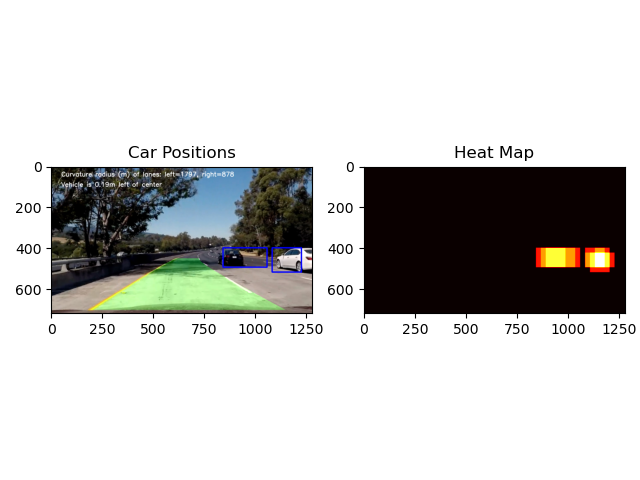

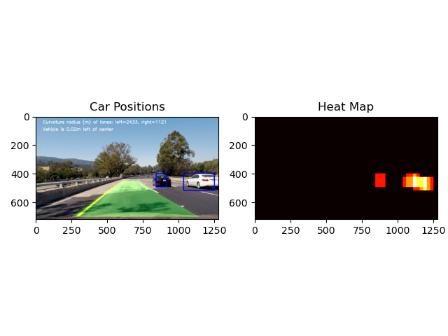

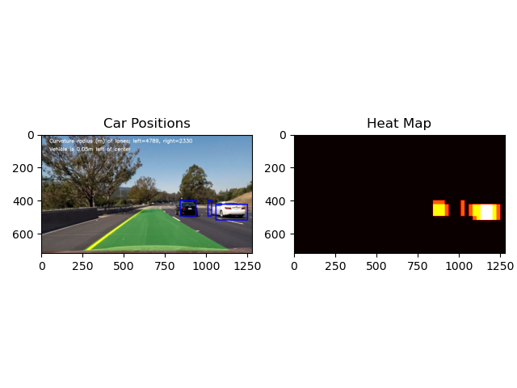

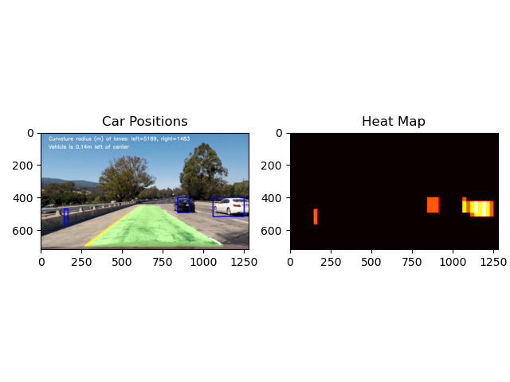

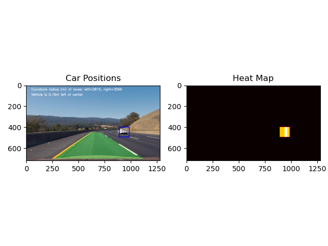

---

### Video Implementation

Here's a [link to my video result](./output_video/project_video_out.mp4)

#### Filter for false positives and combination of overlapping bounding boxes

I recorded the positions of positive detections in each frame of the video.  From the positive detections I created a heatmap and then thresholded that map to identify vehicle positions. In line 339 of the file `vehicle_detector.py` I've set the threshold to 2/8 for the heatmap  I then used `scipy.ndimage.measurements.label()` to identify individual blobs in the heatmap.  I then assumed each blob corresponded to a vehicle.  I constructed bounding boxes to cover the area of each bounding box detected. This approach didn't provide me satisfiable results because of false positive detections also right in front of the vehicle, which is unacceptable. Reason of it that `scipy.ndimage.measurements.label()` puts labels onto detections from top left to bottom right and for each frame individually. Thus, in case of false positive detection, the vehicle 1 can be identified on multiple places along the video stream over different frames. 

That's why I've applied another approach, where I've analyzed top left points of each detection and depending on the margins of the bounding box for a point, I have assigned the detection to a specific vehicle. The acceptance margins for the top left point of each bounding box are set in file `vehicles_tracker.py`, lines 9-10. The code of this implementation can be found in lines 12 - 30 in function `get_most_suitable_tracker_id()` of the file `vehicles_tracker.py`

#### Tracking vehicle

For each vehicle a VehicleBBox class is created (file `vehicle_bbox.py`). This way previous detections of the vehicle are tracked over multiple frames to smooth out the bounding box and false negative detections.

#### Averaging bounding box and vehicle tracking

In order to smooth the tracking of the vehicle, I have assigned an averaged bounding box to each detected and tracked vehicle, that appears over multiple frames. The code can be found in lines 21 - 39, function `update_averaged_bbox()` of file `vehicle_bbox.py`.

The values for the size of queue, threshold for significant detections as well as threshold for removing the detections from the queue can be fine-tuned.

---

### Discussion

#### Problems / issues I have faced in the implementation of this project.  

There are multiple problems I have occurred. The biggest one is the smooth transition of bounding boxes from frame to frame basically to track each vehicle. 

Another problem was to separate false positive detections from sporadic true positive detections. Thus it was difficult to find a good combination of values:

* in how many frames an image should be detected to be declared as reliable
* how many vehicle detections should be stored per vehicle, to assure smooth and reliable tracking
* from which frame the sequence of true positive detections should be disqualified due to uncertainty

#### Where will your pipeline likely fail?

Most likely the pipeline will fail in following situations:

* tracking vehicles, moving orthogonal to the camera
* multiple vehicles close to each other
* very fast moving vehicles

#### What could you do to make it more robust?

* Add confidence layer to each heatmap based on amount of overlapping frames or intensity of the color in the heatmap.

  This confidence should be propagated all the way to the `vehicle_bbox.py` and have influence on how much to rely on this bounding box while tracking of a single vehicle.

* Add measurements from radar or IR-Sernsors to make the detection more robust and precise.

* Improve the `vehicle_tracker` pipeline to robustly track each vehicle